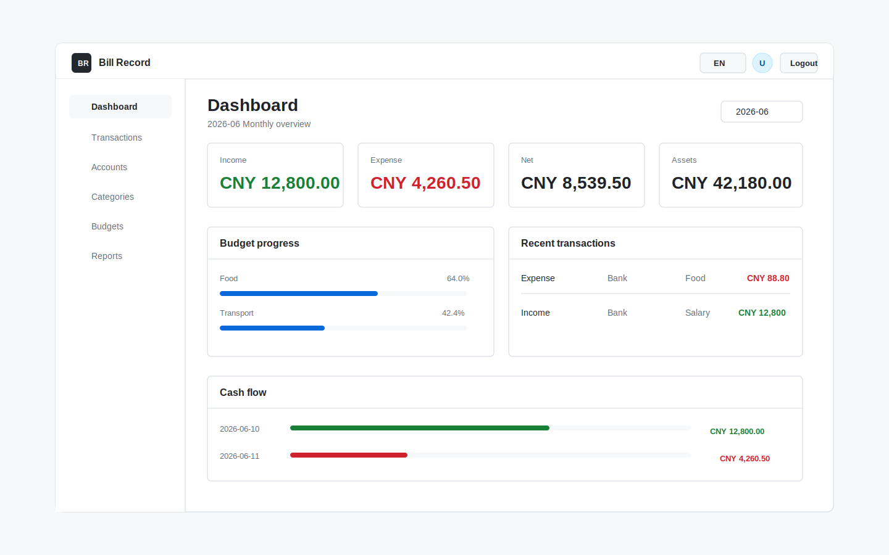
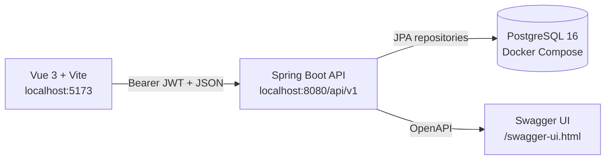

# Bill Record

[](https://openjdk.org/)
[](https://spring.io/projects/spring-boot)
[](https://vuejs.org/)
[](https://vite.dev/)
[](https://www.postgresql.org/)
[](https://docs.docker.com/compose/)

A modern personal finance app with a Spring Boot REST API and an independent Vue 3 dashboard for accounts, transactions, budgets, and reports.

Bill Record is designed as a clean full-stack bookkeeping project: the backend owns domain rules, authentication, persistence, and reporting; the frontend is a standalone Vite app that talks to the API through a typed client. It is small enough to understand, but complete enough to be a useful reference for production-style CRUD, JWT security, Flyway migrations, and frontend/backend separation.



## Highlights

- Independent Vue 3 frontend running on `localhost:5173`
- Spring Boot REST API running on `localhost:8080`
- JWT registration, login, and protected user profile
- Account management with current balance tracking
- Income, expense, and transfer transactions
- Monthly category budgets with spent and remaining values
- Monthly summary, category spending, cash-flow, and account balance reports
- Bilingual UI with one-click Chinese / English switching
- GitHub-style interface using Material Symbols icons
- PostgreSQL schema managed by Flyway migrations
- OpenAPI documentation through Swagger UI
- Focused unit, MVC, and frontend tests

## Demo Flow

1. Register or sign in.
2. Create an account such as cash, bank, credit card, or investment.
3. Use the seeded default categories or create your own.
4. Record income, expenses, and transfers.
5. Add monthly budgets for expense categories.
6. Review dashboard cards, budget progress, category spending, and cash flow.

## Architecture



The frontend and backend are intentionally decoupled. The Vue app can be built and deployed as static assets, while the Spring Boot service can be deployed as a normal API server. The frontend API base URL is controlled by `VITE_API_BASE_URL`.

## Tech Stack

| Layer | Technology |
| --- | --- |
| Frontend | Vue 3, Vite, TypeScript, Pinia, Vue Router |
| UI | Custom GitHub-style CSS, Material Symbols |
| Backend | Java 21, Spring Boot 3.3, Spring Security |
| Persistence | PostgreSQL 16, Spring Data JPA, Flyway |
| API docs | springdoc-openapi, Swagger UI |
| Mapping and utilities | MapStruct, Lombok, jjwt |
| Testing | JUnit 5, MockMvc, Testcontainers, Vitest, Vue Test Utils |
| Runtime | Docker, Docker Compose, Maven, npm |

## Quick Start

### Prerequisites

- Java 21
- Node.js 20 or newer
- Docker Desktop or another Docker runtime
- npm 10 or newer

### 1. Start PostgreSQL

```bash
docker compose up -d postgres
```

### 2. Start the backend

```bash
JAVA_HOME=/opt/homebrew/opt/openjdk@21/libexec/openjdk.jdk/Contents/Home ./mvnw spring-boot:run
```

Backend endpoints:

- API base URL: `http://localhost:8080/api/v1`
- Swagger UI: `http://localhost:8080/swagger-ui.html`
- OpenAPI JSON: `http://localhost:8080/v3/api-docs`

### 3. Start the frontend

```bash
cd frontend
npm install
npm run dev
```
Frontend URL:

```text
http://localhost:5173
```

The local frontend uses:

```text
VITE_API_BASE_URL=http://localhost:8080/api/v1
```

To override it, create `frontend/.env`:

```bash
VITE_API_BASE_URL=http://localhost:8080/api/v1
```

## Testing

Run backend tests:

```bash
JAVA_HOME=/opt/homebrew/opt/openjdk@21/libexec/openjdk.jdk/Contents/Home ./mvnw test
```

Run frontend tests:

```bash
cd frontend
npm run test:run
npm run build
```

Useful runtime smoke flow:

```bash
curl -I http://localhost:8080/swagger-ui.html
curl -I http://localhost:5173
```

## API Overview

All API routes are prefixed with `/api/v1`. Register or log in first, then call protected endpoints with:

```http
Authorization: Bearer <accessToken>
```

| Area | Endpoint | Purpose |
| --- | --- | --- |
| Auth | `POST /auth/register` | Create a user and return an access token |
| Auth | `POST /auth/login` | Authenticate and return an access token |
| Users | `GET /users/me` | Fetch the current profile |
| Accounts | `GET /accounts` | List active accounts |
| Accounts | `POST /accounts` | Create an account |
| Categories | `GET /categories` | List income and expense categories |
| Categories | `POST /categories` | Create a custom category |
| Transactions | `GET /transactions` | List and filter transactions |
| Transactions | `POST /transactions` | Create income, expense, or transfer |
| Budgets | `GET /budgets?month=2026-06` | List monthly budgets |
| Budgets | `POST /budgets` | Create a monthly category budget |
| Reports | `GET /reports/monthly-summary?month=2026-06` | Income, expense, net, balances |
| Reports | `GET /reports/category-spending?from=...&to=...` | Expense totals by category |
| Reports | `GET /reports/cash-flow?from=...&to=...` | Daily income, expense, net series |

Runnable examples live in [`docs/http/auth.http`](docs/http/auth.http).

## Repository Structure

```text
.
├── frontend/                     # Independent Vue 3 + Vite frontend
│   ├── src/api/                  # Typed API client and feature modules
│   ├── src/components/           # Reusable UI components
│   ├── src/i18n/                 # Chinese / English message dictionary
│   ├── src/router/               # Vue Router routes and guards
│   ├── src/stores/               # Pinia auth, ledger, preferences stores
│   ├── src/styles/               # GitHub-style CSS
│   └── src/views/                # Product pages
├── src/main/java/com/hwiyn/      # Spring Boot backend source
├── src/main/resources/db/        # Flyway migrations
├── src/test/java/com/hwiyn/      # Backend tests
├── docs/http/                    # Runnable HTTP examples
├── docs/assets/                  # README assets
├── compose.yaml                  # PostgreSQL local development service
├── Dockerfile                    # Backend container image
└── README.md
```

## Configuration

### Backend

| Variable | Default | Description |
| --- | --- | --- |
| `BILL_RECORD_DB_URL` | `jdbc:postgresql://localhost:5432/bill_record` | PostgreSQL JDBC URL |
| `BILL_RECORD_DB_USERNAME` | `bill_record` | Database user |
| `BILL_RECORD_DB_PASSWORD` | `bill_record` | Database password |
| `BILL_RECORD_JWT_SECRET` | development fallback | JWT signing secret |
| `SERVER_PORT` | `8080` | Backend port |

### Frontend

| Variable | Default | Description |
| --- | --- | --- |
| `VITE_API_BASE_URL` | `http://localhost:8080/api/v1` | Backend API base URL |

## Design Notes

- Money uses `BigDecimal` / PostgreSQL `numeric(19,2)`.
- Timestamps are stored as UTC `Instant`.
- Users own their accounts, categories, transactions, and budgets.
- Default categories are copied per user at registration.
- Transaction updates and deletes reverse the previous balance effect before applying the new one.
- The frontend stores only UI state and the access token; financial calculations remain backend-owned.

## Roadmap

- Add hosted demo deployment
- Add end-to-end browser tests
- Add import/export for CSV or OFX-style data
- Add recurring transactions
- Add multi-currency exchange-rate support
- Add charts for longer date ranges
- Add release automation and a public license

## Suggested GitHub Topics

```text
personal-finance bookkeeping budget-tracker finance-app spring-boot java vue vue3 vite typescript pinia postgresql flyway jwt rest-api docker maven
```

## 中文简介

Bill Record 是一个前后端解耦的个人记账项目。后端使用 Spring Boot、PostgreSQL、Flyway、JWT 和 OpenAPI，前端使用独立的 Vue 3 + Vite 应用。项目支持账户、分类、收入、支出、转账、预算、月度汇总、分类支出和现金流报表，并提供中英文一键切换。

本地开发默认端口：

- 前端：`http://localhost:5173`
- 后端：`http://localhost:8080`
- API：`http://localhost:8080/api/v1`
- Swagger：`http://localhost:8080/swagger-ui.html`

快速启动：

```bash
docker compose up -d postgres
JAVA_HOME=/opt/homebrew/opt/openjdk@21/libexec/openjdk.jdk/Contents/Home ./mvnw spring-boot:run

cd frontend
npm install
npm run dev
```
